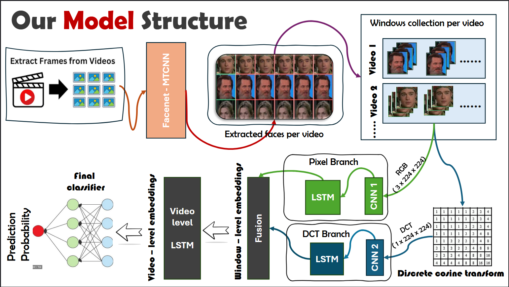

# Deepfake Video Detection using Deep Learning
## 🏗️ Model Architecture

## 📌 Overview
This project focuses on detecting deepfake videos using a hierarchical deep learning approach that combines **spatial**, **frequency-domain**, and **temporal** features. With the rapid advancement of generative models, deepfake content has become increasingly realistic, posing serious risks related to misinformation, privacy, and digital trust.

The proposed system analyzes facial regions extracted from videos and learns both frame-level artifacts and long-term temporal inconsistencies to classify a video as **Real** or **Fake**.

This work was developed as an academic project and implemented using Python and deep learning frameworks, with experiments conducted on the **Celeb-DF v2** dataset.

---

## 🧠 Key Concepts Used
- Convolutional Neural Networks (CNNs)
- Long Short-Term Memory Networks (LSTMs)
- Frequency-domain analysis using Discrete Cosine Transform (DCT)
- Face detection and alignment
- Hierarchical and multi-stage learning

---

## 📂 Dataset
**Celeb-DF v2**

- High-quality deepfake video dataset
- Contains real and manipulated videos of celebrities
- Widely used benchmark for deepfake detection research

Dataset link:  
https://github.com/yuezunli/celeb-deepfakeforensics

---

## 🏗️ Model Architecture

The model follows a **multi-level hierarchical structure**:

### 1️⃣ Face Extraction & Preprocessing
- Videos are split into frames
- Faces are detected using **MTCNN**
- Extracted faces are resized and normalized
- Consecutive frames are grouped into fixed-size **windows**

---

### 2️⃣ Dual Feature Extraction Branches

#### 🔹 Pixel (Spatial) Branch
- CNN extracts spatial features from RGB face frames
- Captures visual artifacts such as blending errors, texture inconsistencies, and facial distortions

#### 🔹 Frequency (DCT) Branch
- Discrete Cosine Transform (DCT) applied to face images
- CNN learns frequency-domain artifacts caused by GAN upsampling and compression

---

### 3️⃣ Window-Level Temporal Modeling

- Frame-level embeddings from both branches are passed into **LSTMs**
- Produces a single embedding per window, capturing short-term temporal inconsistencies

---

### 4️⃣ Video-Level Aggregation
- Window embeddings are fused
- A second LSTM aggregates information across the entire video
- Generates a compact **video-level embedding**

---

### 5️⃣ Classification
- Final embedding passed through a fully connected classifier
- Outputs probability of the video being **Real** or **Fake**

---

## 🏋️ Training Strategy
To prevent overfitting, the model is trained using **hierarchical learning**:
- Initial training of lower-level components
- Gradual fine-tuning of higher-level temporal modules
- Helps stabilize training on limited video data

---

## 📊 Results
- The model successfully learns spatial, frequency, and temporal patterns from Celeb-DF v2
- Demonstrates strong performance within the dataset
- Highlights the importance of combining spatial and temporal cues for deepfake detection

> ⚠️ Note: Results are dataset-specific and may not directly generalize to other deepfake datasets without further training.

---

## ⚠️ Limitations
- Trained only on **Celeb-DF v2**, limiting cross-dataset generalization
- High computational cost due to multi-stage CNN + LSTM architecture
- Relies on reliable face detection; performance may degrade for:
  - Occlusions
  - Extreme poses
  - Low-quality or heavily compressed videos
- Audio-visual consistency is not currently incorporated

---

## 🚀 Future Improvements
- Train on multiple datasets (FaceForensics++, DFDC)
- Introduce audio-visual consistency checks
- Optimize model for real-time inference
- Explore transformer-based temporal modeling

---

## 🔗 Kaggle Notebook
You can view the complete implementation and experiments here:  
👉 https://www.kaggle.com/code/msdusss/deepfakevideodetectionfinal/notebook

---

## 🛠️ Technologies Used
- Python
- TensorFlow / Keras
- OpenCV
- NumPy
- MTCNN
- Jupyter Notebook

---

## 👨‍💻 Authors
- Vivek Kumar Dutta  
- Sanchita Tewary  
- Souvik Sen  

---

## 📜 License
This project is intended for **academic and research purposes only**.

---

## 🙌 Acknowledgements
- Celeb-DF dataset authors
- Kaggle platform for compute resources
- Faculty mentor for guidance and feedback

